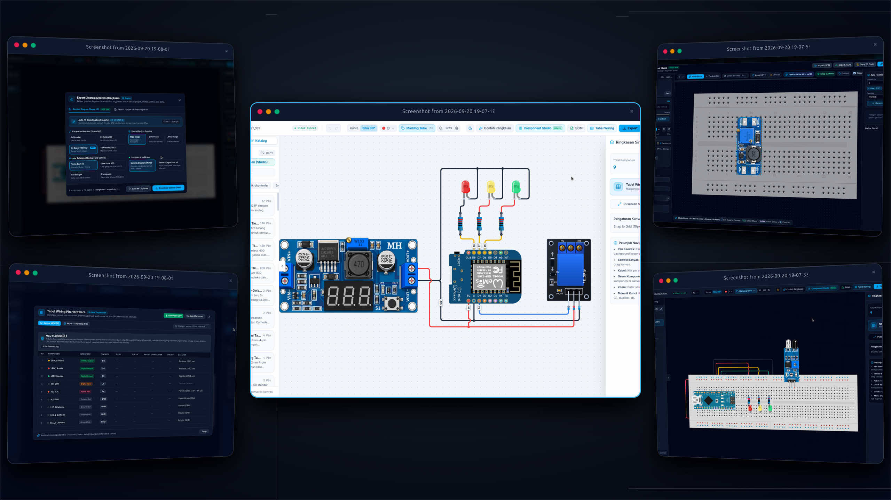

<p align="center">
  
</p>

# ⚡ Wirecraft

<div align="center">

[](package.json)
[](https://react.dev/)
[](https://www.typescriptlang.org/)
[](https://vitejs.dev/)
[](https://tailwindcss.com/)
[](https://bun.sh/)
[](LICENSE)

**Interactive Web-Based Circuit, IoT Electronics & High-Voltage Electrical Wiring Simulator**  
Design, simulate, and export realistic electronic circuits, microcontroller prototypes, and photorealistic AC electrical fixtures with smart orthogonal wire routing directly in your browser.

[Features](#-features-overview) • [Quick Start](#-quick-start) • [Tech Stack](#-tech-stack) • [Component Studio](#-component-studio) • [Shortcuts](#-keyboard-shortcuts--canvas-controls) • [Architecture](#-project-structure)

</div>

---

## ✨ Features Overview

### 🎨 Custom Component Studio
Create and calibrate your own electronic or electrical components without touching code:
- **Visual Pin Editor**: Place custom pins with precision, define pin types (Digital, Analog, Power, Ground, AC Live/Neutral, Earth), labels, and signals.
- **Image Calibration**: Upload PNG/SVG graphics, automatically remove backgrounds, crop, scale, and adjust offsets.
- **Pin Grid Snapping & Pitch Distribution**: Align pins with standard 2.54mm breadboard pitch or distribute pins evenly along headers.
- **Persistent Library**: Save custom components directly to your workspace or export/import them as reusable JSON definitions.

### 🔌 Photorealistic AC 220V & Power Fixtures
Bridge the gap between low-voltage electronics and real-world high-voltage wiring:
- **AC Wall Outlet (Schuko Type-F)**: Dual live/neutral sockets, brass earth contact clips, and realistic screw terminal blocks.
- **Ceiling Lamp Holder (Fitting Lampu E27)**: Live/neutral terminals with dynamic real-time LED bulb illumination states (ON / OFF).
- **AC Plug with Rocker Switch (Steker Saklar Broco)**: Interactive switch toggle with glowing red neon indicator and 3-wire terminations (L, PE, N).
- **Industrial SMPS 12V Power Supply**: Perforated metal mesh casing, dual AC input, frame ground, and dual DC output terminals.
- **LM2596S DC-DC Buck Converter**: Adjustable step-down voltage regulator module with 4 precision screw pads.

### 🧠 Microcontrollers & Prototyping
- **ESP32 NodeMCU (30-Pin)**: Accurate GPIO pin matrix, dual header spacing, ADC, DAC, capacitive touch, and power rails.
- **Arduino Uno R3**: Standard digital PWM headers, analog input banks, ICSP headers, and DC barrel jack.
- **Modular Breadboards**: Full-size (830 tie-points), Half-size (400 tie-points), and Mini (170 tie-points) with 2.54mm / 17px pin snap-grid.

### 〰️ Smart Orthogonal Wire Routing & Real-World Physics
- **Intelligent Pathfinding Engine**: Calculates clean 90-degree orthogonal routes around components and obstacles.
- **Wire Jump-Over Bridges**: Automatic semi-circular arc bridge rendering at wire intersections to eliminate visual ambiguity.
- **Midpoint Bend Editing & Segment Dragging**: Interactive handles to adjust, split, and reshape wire routes with route lock support.
- **Wire Gauges & Realism**: Configure wire gauge (AWG 18, 22, 24, 28), color-coded palettes, ferrule crimp terminal ends, and heat-shrink marking tube labels.

### 🖥️ Displays, Sensors & HMI Modules
- **Displays**: LCD 1602 & LCD 2004 (Parallel & I2C backpack), SSD1306 OLED (128x64 I2C), TFT 2.8" ILI9341 (SPI full-color), and TM1637 4-digit 7-segment clock display.
- **Sensors**: HC-SR04 Ultrasonic, DHT11 & DHT22 Temperature/Humidity, Capacitive Soil Moisture, RC522 RFID 13.56MHz SPI, and DS3231 RTC.
- **Actuators & Controls**: SG90 Micro Servo, Active Buzzers, 1-Channel Relay modules, 6mm/12mm tactile buttons, and rotary potentiometers with draggable dial angle.

### 📦 Export & Documentation Suite
- **HD Schematic Snapshots**: Export ultra high-resolution circuit diagrams in PNG, SVG, or PDF format with customizable scale factors (1x, 2x, 4x) and Dark/Light themes.
- **Bill of Materials (BOM)**: Automatic part counting, component categorization, and instant CSV export.
- **Wiring Schedule Table**: Auto-generated wiring netlist listing Source Pin, Target Pin, Wire Color, Gauge, Length, and Net Name.

### 📁 Multi-File Circuit Workspace & Cloud Sync
- **Virtual File Explorer**: Organize designs into folders, duplicate schematics, rename, and switch between circuits instantly.
- **Project Import/Export**: Save and load complete workspaces as `.wirecraft` or `.json` archives.
- **Cloud Collaboration & Auth**: Integrated authentication, user profile management, and cloud project storage.
- **Embedded Code Editor**: Built-in code editor for Arduino C++ and MicroPython sketches accompanying your circuit designs.

---

## 🛠️ Tech Stack

| Technology | Purpose |
| :--- | :--- |
| **[React 19](https://react.dev/)** | Modern component-driven UI architecture |
| **[TypeScript 5.8](https://www.typescriptlang.org/)** | Strict type safety and robust domain models |
| **[Vite 8](https://vitejs.dev/)** | Lightning-fast development server & optimized production bundler |
| **[Tailwind CSS v4](https://tailwindcss.com/)** | High-performance atomic styling and dark-mode design system |
| **[Bun](https://bun.sh/)** | Ultra-fast JavaScript runtime, test runner, and package manager |
| **[Lucide React](https://lucide.dev/)** | Clean and consistent iconography |
| **[SweetAlert2](https://sweetalert2.github.io/)** | Sleek modal dialogues and toast notifications |

---

## 🚀 Quick Start

### Prerequisites
Make sure you have **[Bun](https://bun.sh/)** (v1.2+ recommended) or **Node.js** (v20+ LTS) installed:

```bash
bun --version
# or: node --version
```

### 1. Clone & Install

```bash
# Clone the repository
git clone https://github.com/fahmiibrahimdevs/wirecraft.git

# Navigate into the project
cd wirecraft

# Install dependencies using Bun (recommended) or npm
bun install
# or: npm install
```

### 2. Run Development Server

```bash
bun run dev
# or: npm run dev
```

Open [http://localhost:5180](http://localhost:5180) in your web browser.

### 3. Build for Production

```bash
bun run build
# or: npm run build
```

The optimized static production files will be output to the `dist/` directory.

---

## ⌨️ Keyboard Shortcuts & Canvas Controls

| Action | Shortcut / Gesture |
| :--- | :--- |
| **Pan Canvas** | `Space + Drag` or `Middle Mouse Drag` |
| **Zoom Canvas** | `Mouse Wheel` or `Ctrl + '+' / '-'` |
| **Select All** | `Ctrl + A` |
| **Delete Selected** | `Delete` or `Backspace` |
| **Duplicate Selection** | `Ctrl + D` |
| **Rotate Component (90°)** | `R` |
| **Flip Component Horizontal** | `H` |
| **Flip Component Vertical** | `V` |
| **Undo / Redo** | `Ctrl + Z` / `Ctrl + Y` (`Ctrl + Shift + Z`) |
| **Cancel Wire / Deselect** | `Escape` |
| **Snap-to-Grid** | Automatic 17px (2.54mm pitch) snapping |

---

## 📁 Project Structure

```
wirecraft/
├── public/
│   ├── components/                 # Photorealistic SVG & transparent component assets
│   └── favicon.ico
├── src/
│   ├── components/
│   │   ├── canvas/                 # SVG Canvas, wire rendering & interactive hitboxes
│   │   │   └── shapes/             # Custom SVG shape renderers (Resistors, Buttons, LCD, etc.)
│   │   ├── menu/                   # Right-click context menus & quick actions
│   │   ├── modals/                 # Feature modals (Export, BOM, Auth, Wiring Table, etc.)
│   │   │   └── studio/             # Component Studio (Pin Editor, Form, Preview & Image Calibration)
│   │   ├── navigation/             # Top navigation bar, tool selector & breadcrumb
│   │   └── panels/                 # Component Library, File Explorer & Inspector sections
│   │       └── inspector/          # Dedicated property editors (Wires, Components, Resistors)
│   ├── constants/                  # Component definitions, pin databases, and starter circuits
│   ├── context/                    # React Context providers for circuit files and state
│   ├── hooks/                      # Custom hooks for gestures, hotkeys, dragging, wires, and modals
│   ├── types/                      # TypeScript schemas (Circuit, Pins, Wires, Components, Auth)
│   ├── utils/                      # Orthogonal router, wire translation, color maps & helpers
│   ├── App.tsx                     # Main application layout and modal container integration
│   ├── index.css                   # Tailwind CSS v4 stylesheets and typography
│   └── main.tsx                    # React application root entry point
├── package.json
├── tsconfig.json
└── vite.config.ts
```

---

## 📄 License

This project is licensed under the **MIT License** — see the [LICENSE](LICENSE) file for details.

---

<div align="center">
  Developed with ❤️ by <a href="https://github.com/fahmiibrahimdevs">fahmiibrahimdevs</a>
</div>
